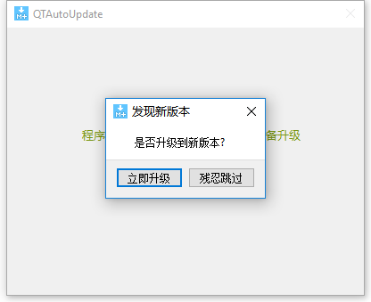
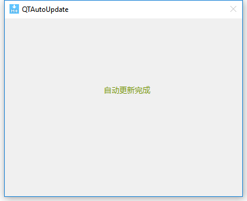

# QTAutoUpdate
it's a auto update tool for any execute, includes 2 qtcreator projects, based on qt 5.11.1

## usage
### 1.version tool
it's a gui tool which read a directory and produce a 'version.version' file inside the directory.

cd to VersionToolForUpdate/bin and run this version tool
#### 

select a app directory which is about to be deployed in your website
#### 

wait a second add you will see a 'version.version' file inside this directory.
Also deploy this 'version.version' file in your website.
Every time you run version tool, 'version.version' is new. 
so when a remote user connet to your website, your website
app directory will be sync to the remote user's app directory
#### 
#### 

notice there is a 'versionconfig.ini' file inside the app directory, which you should place it before you run version tool, the ini file like:
```cpp
[info]
forceupdate=0;
version=http://127.0.0.1:8081/app/version.version
romoteappdir=http://127.0.0.1:8081/app
textversion=1.0.0.1.09101025
app=app.exe
#something else
```
the user's app should have a old version ini file like this, even if the app is the first version and never auto updated once
### 2.auto update
copy files inside QTAutoUpdate/bin to your app directory(strictly QTAutoUpdate.exe and app.exe will in the same directory)
send your app to user after place a 'version.version' and a 'versionconfig.ini' file for the first time.
next time you run QTAutoUpdate.exe, user's app will sync by website app automatically.

notice that i suggest you to run QTAutoUpdate.exe to start you app.exe. the reason is QTAutoUpdate.exe will run your app.exe set by 'versionconfig.ini' automatically 
after update. so pass the argc to QTAutoUpdate.exe which you intend to pass to app.exe.

of cource, if you want to start app.exe first, you can modify the source code in your way.

Here are some captured png you may see:
#### 
#### 
#### 

## notice
Although i decribed the usage on windows system, actually it's a cross-platform tool coded by QT.
So the files inside QTAutoUpdate/bin may be the same with your own app dependent. If so,
try use the same QT version.

there is a selfupdate project to update QTAutoUpdate.exe itself. just place their exe in the same directory.

## sum up
so here is the basic flow showing how to use the auto update tools.
Deploy First Version of your app:
1.place the files in QTAutoUpdate/bin to your app dir;
2.create a 'versionconfig.ini' file in app dir;
3.user version tool to get a 'version.version' file in your app dir;
4.deploy your app for the first time, also place your app in website;
Deploy new version of your app:
1.change 'versionconfig.ini' file after you setup a new version app;
2.user version tool to get a new 'version.version' file in your app dir;
3.put your new app to website;


